<a href="../img/DSC_0039.JPG" data-toggle="lightbox" data-gallery="photography">
  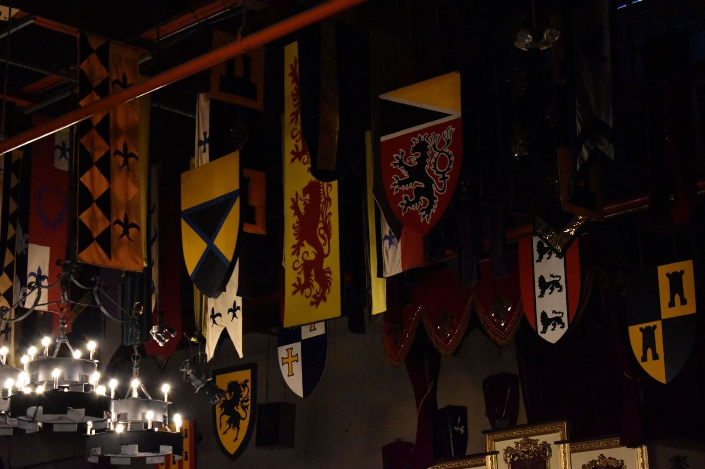
</a>

<a href="../img/DSC_0533.JPG" data-toggle="lightbox" data-gallery="photography">
  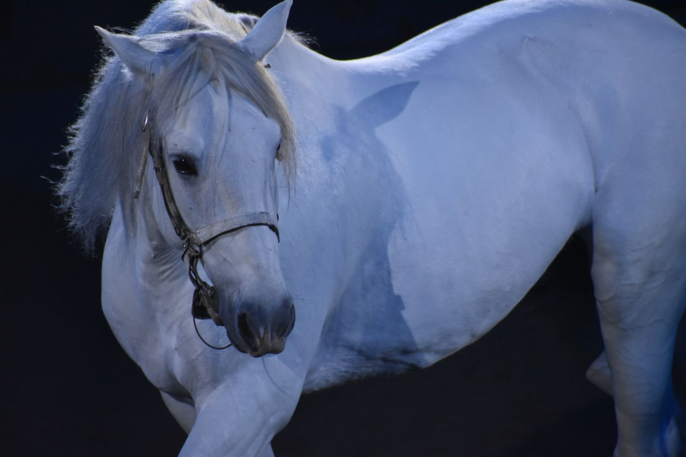
</a>

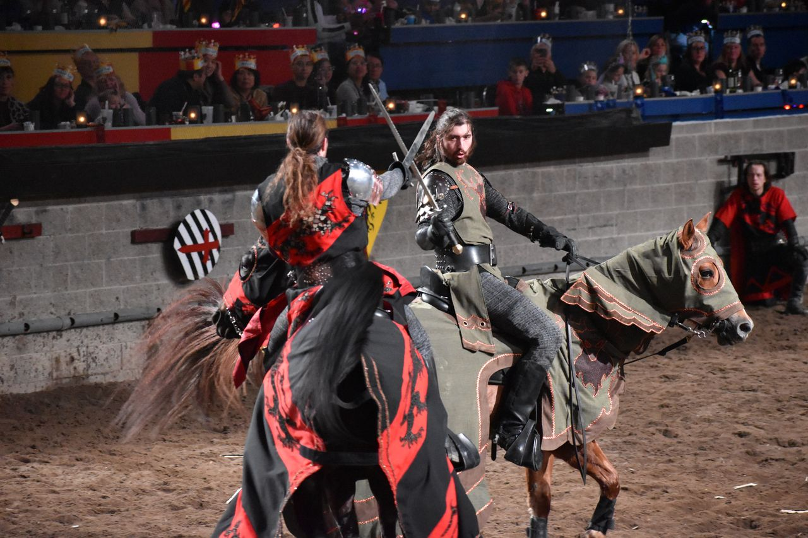

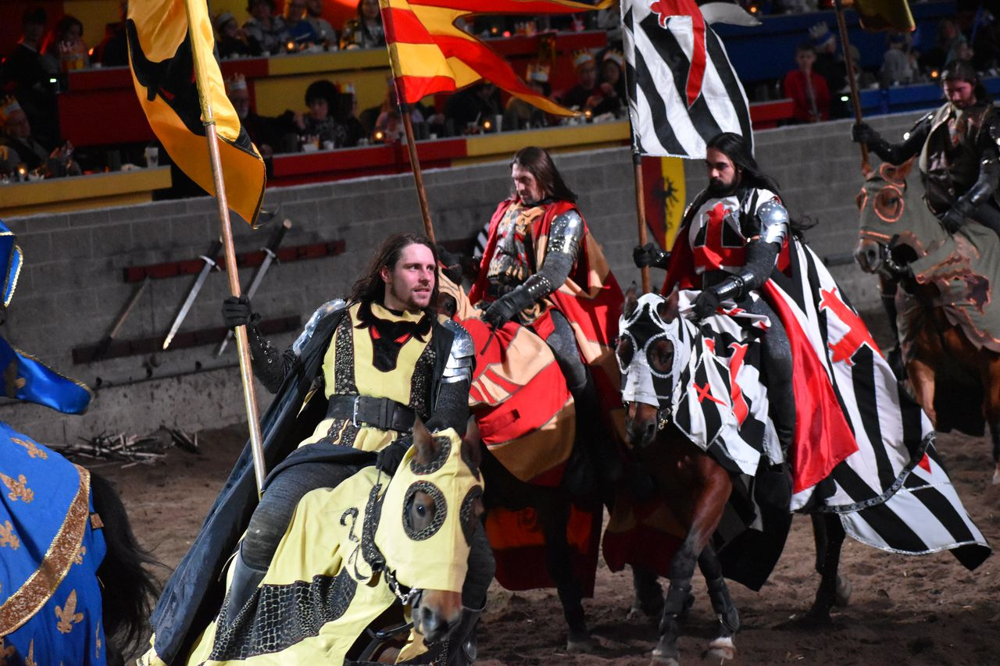

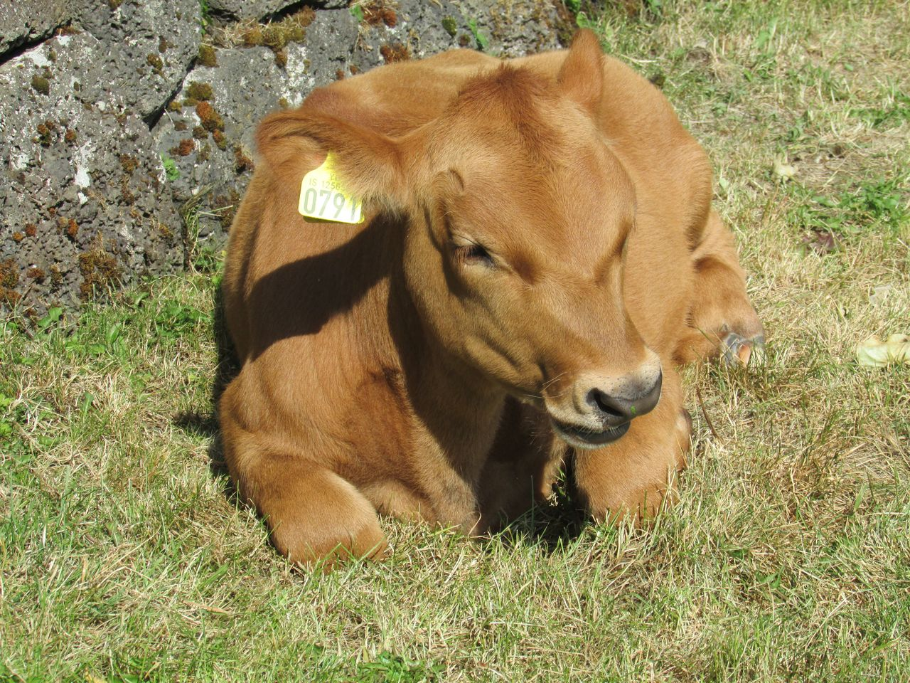

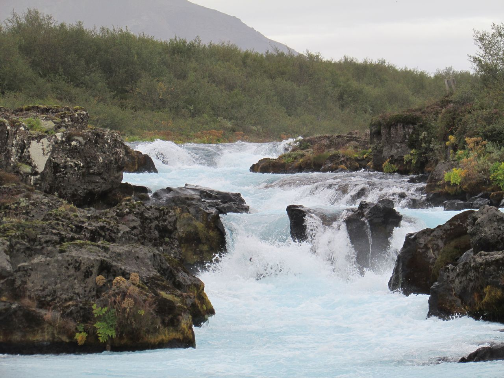

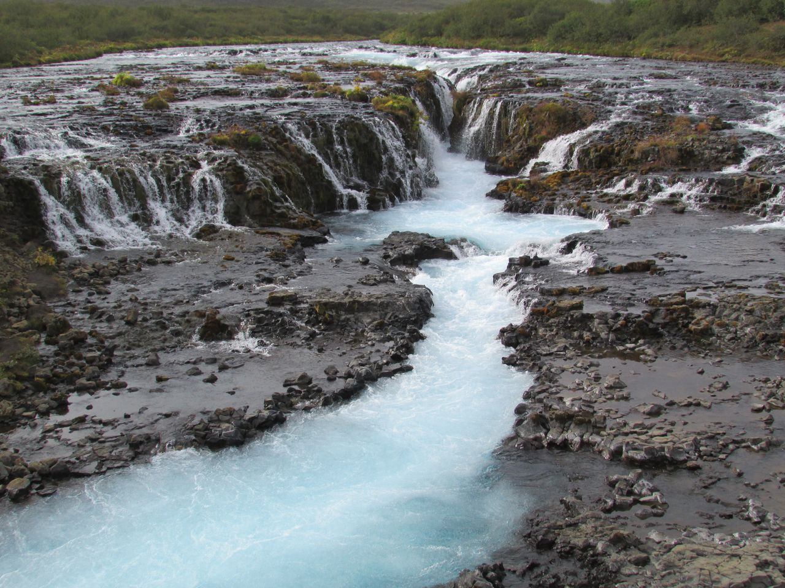

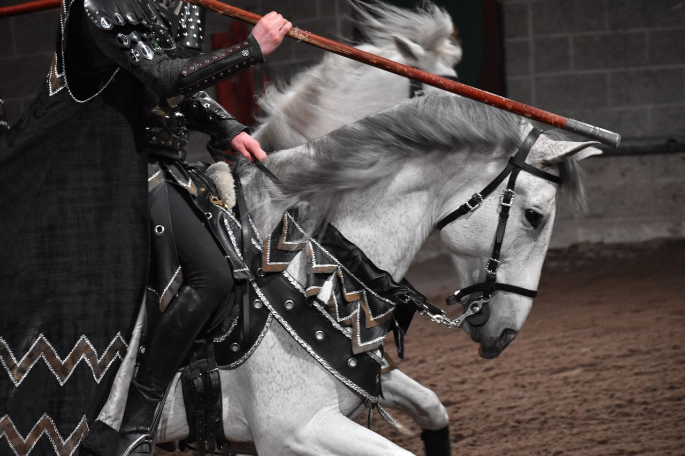

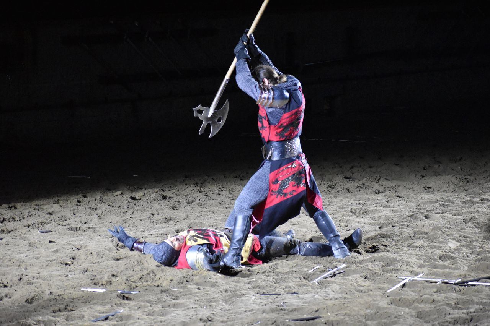

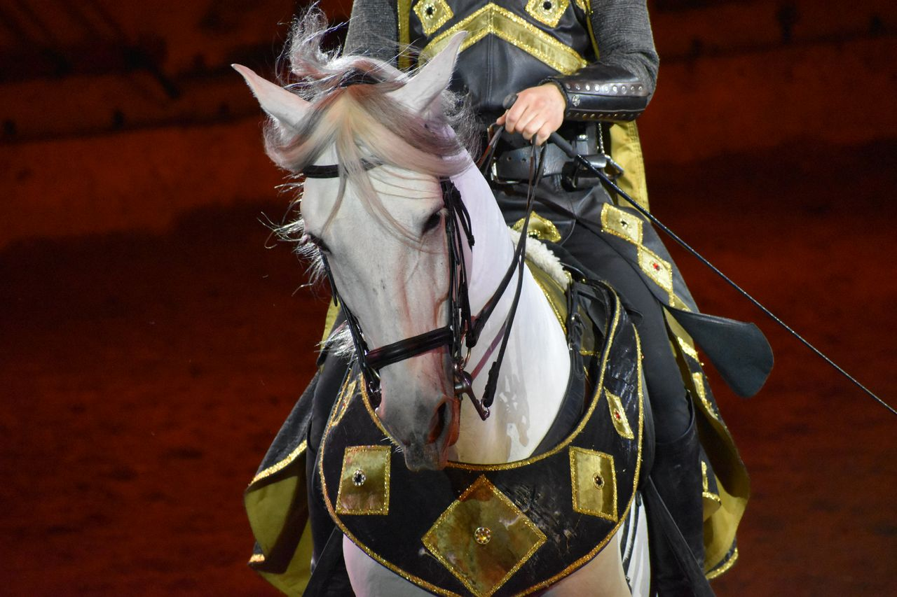

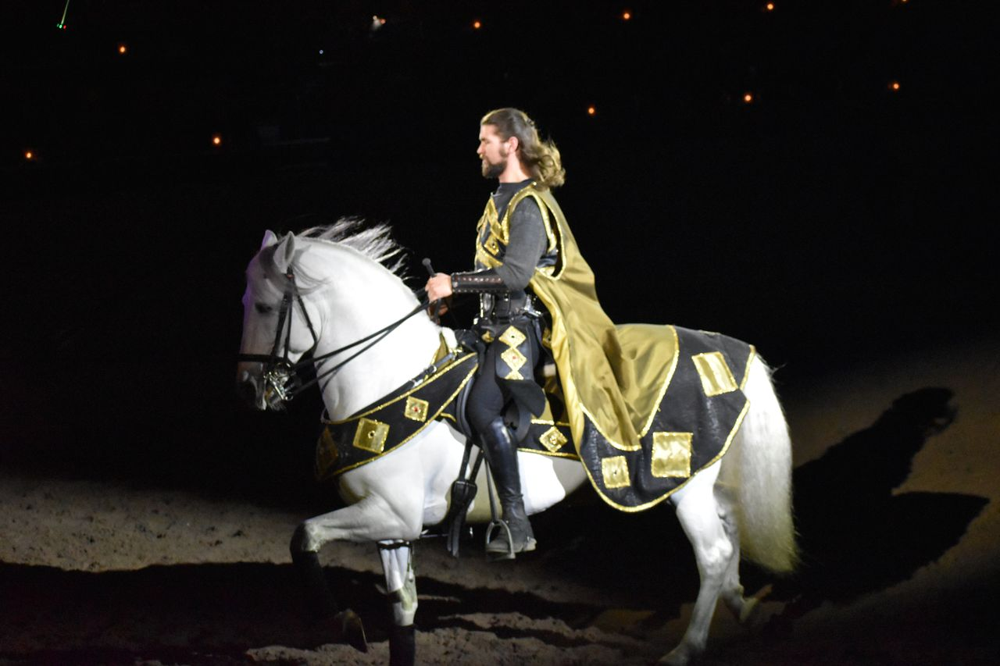

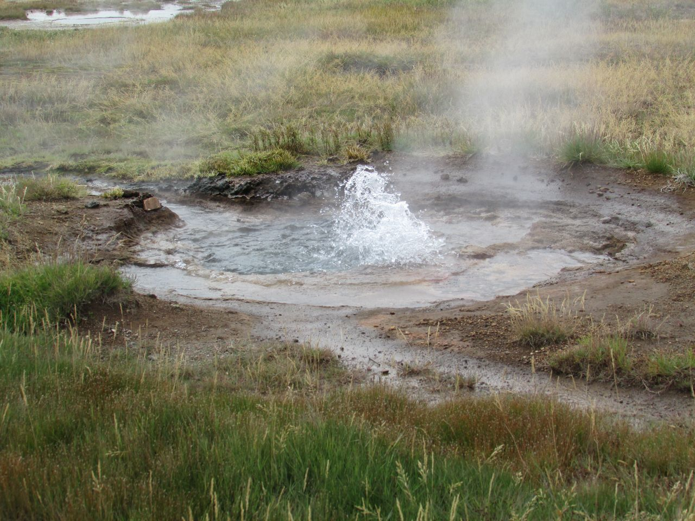

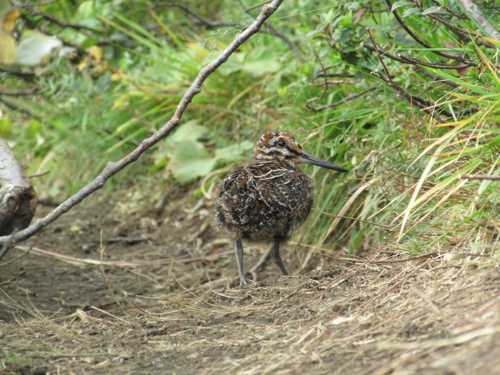

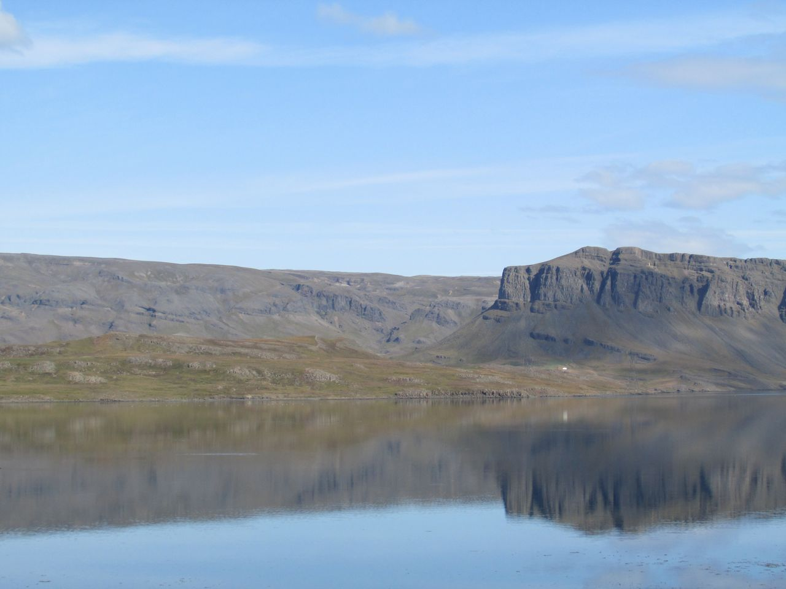

$(document).on('click', '[data-toggle="lightbox"]', function(event) {
                event.preventDefault();
                $(this).ekkoLightbox();
            });
